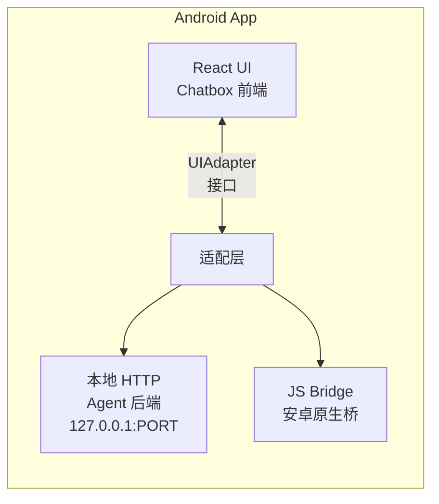

# UI 隔离层设计

## 架构

本项目的目标是构建一个融合 Chatbox UI 与 Agent 后端能力的安卓应用。为了解耦 UI 与后端，设计了 UIAdapter 隔离层。



## 核心接口

```typescript
interface UIAdapter {
  /** 发送消息（流式） */
  sendMessage(
    sessionId: string,
    content: string,
    attachments?: Attachment[]
  ): AsyncGenerator<AdapterChunk>

  /** 停止生成 */
  abortGeneration(): void

  /** 获取会话列表 */
  listSessions(): Promise<SessionSummary[]>

  /** 管理会话 */
  createSession(config?: SessionConfig): Promise<string>
  deleteSession(id: string): Promise<void>
  renameSession(id: string, title: string): Promise<void>
}
```

## 适配模式

| 模式 | 调用路径 | 适用场景 |
|------|----------|----------|
| HTTP | UI → fetch → Agent HTTP Server | 开发调试、桌面端 |
| Bridge | UI → JS Bridge → 原生代码 → Agent Core | 生产环境、安卓端 |

UI 层代码只需面向 `UIAdapter` 接口编程，不关心底层是 HTTP 还是 Bridge。

## 设计目标

1. UI 代码零感知后端类型（HTTP / Bridge / 直连）
2. 流式响应统一封装为 `AsyncGenerator<AdapterChunk>`
3. 可随时切换实现，无需改 UI 层代码
4. 安卓端优先使用 JS Bridge，性能最优
